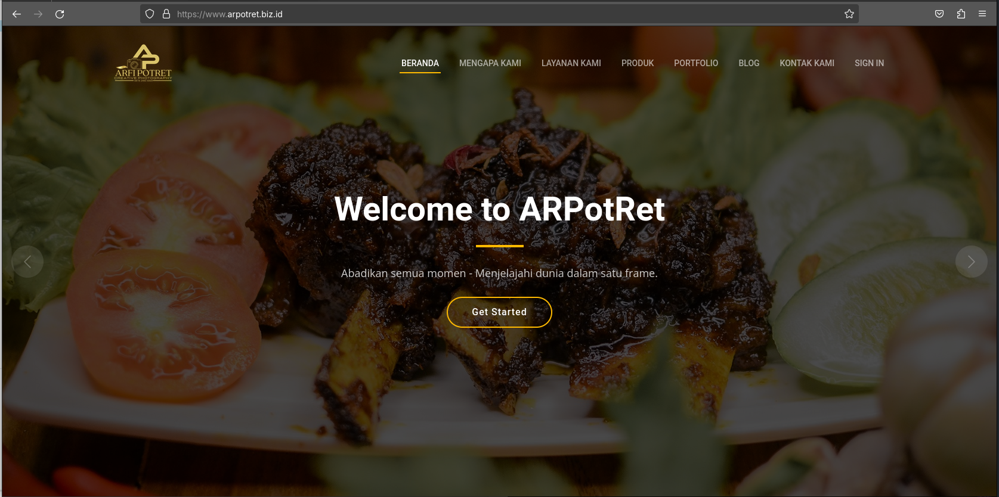
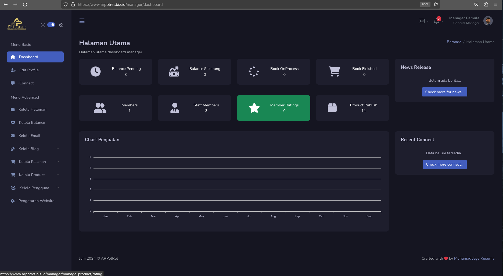

<small align="center">Preview FrontPage</small>

<small align="center">Preview Dashboard Admin</small>

<a href="CHANGELOG.MD">ARPotret - Open Source Project | v.1.0a - Changelogs</a>
 
Latest Update: 22 Juni 2024

## About ARPotret - Photography Service By Internal Dev

Web Arpotret ini adalah website Pemesanan Jasa Fotografi yang Berlisensi Open Source ( MIT License ). Website ini dibangun untuk mempermudah konsumen dalam melakukan pemesanan jasa fotografi serta mempermudah penyedia jasa dalam mengelola produknya. Pada website ini memiliki fitur yang cukup lengkap mulai dari pemesanan secara online, pengelolaan data keuangan, serta masih banyak lagi fitur yang tersedia. Dengan adanya website ini diharapkan dapat mempermudah para penyedia jasa fotografi.

## Fitur Lengkap

- Fitur Kelola Halaman Utama Website
- Fitur Kelola Jenis Jasa Yang Ditawarkan
- Fitur Kelola Portofolio Fotografer
- Fitur Kelola Blog / Berita
- Fitur Pemesanan Melalui Website
- Fitur Chat Dalam Website
- Fitur Registrasi / Login / Dashboard Pada Klient Area
- Fitur

## Laravel Sponsors

We would like to extend our thanks to the following sponsors for funding Laravel development. If you are interested in becoming a sponsor, please visit the [Laravel Partners program](https://partners.laravel.com).

### Premium Partners

- **[Vehikl](https://vehikl.com/)**
- **[Tighten Co.](https://tighten.co)**
- **[WebReinvent](https://webreinvent.com/)**
- **[Kirschbaum Development Group](https://kirschbaumdevelopment.com)**
- **[64 Robots](https://64robots.com)**
- **[Curotec](https://www.curotec.com/services/technologies/laravel/)**
- **[Cyber-Duck](https://cyber-duck.co.uk)**
- **[DevSquad](https://devsquad.com/hire-laravel-developers)**
- **[Jump24](https://jump24.co.uk)**
- **[Redberry](https://redberry.international/laravel/)**
- **[Active Logic](https://activelogic.com)**
- **[byte5](https://byte5.de)**
- **[OP.GG](https://op.gg)**

## Contributing

Thank you for considering contributing to the Laravel framework! The contribution guide can be found in the [Laravel documentation](https://laravel.com/docs/contributions).

## Code of Conduct

In order to ensure that the Laravel community is welcoming to all, please review and abide by the [Code of Conduct](https://laravel.com/docs/contributions#code-of-conduct).

## Security Vulnerabilities

If you discover a security vulnerability within Laravel, please send an e-mail to Taylor Otwell via [taylor@laravel.com](mailto:taylor@laravel.com). All security vulnerabilities will be promptly addressed.

## License

The Laravel framework is open-sourced software licensed under the [MIT license](https://opensource.org/licenses/MIT).
